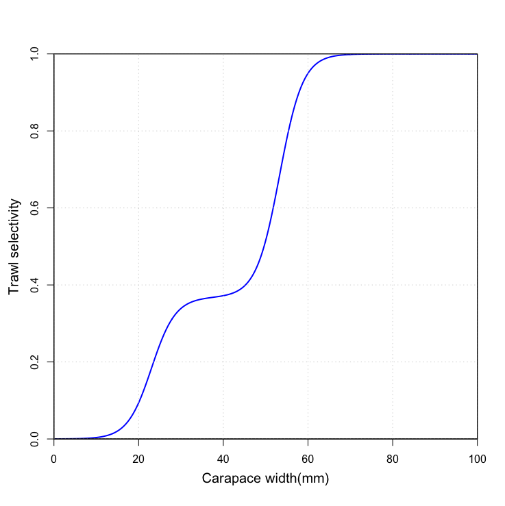
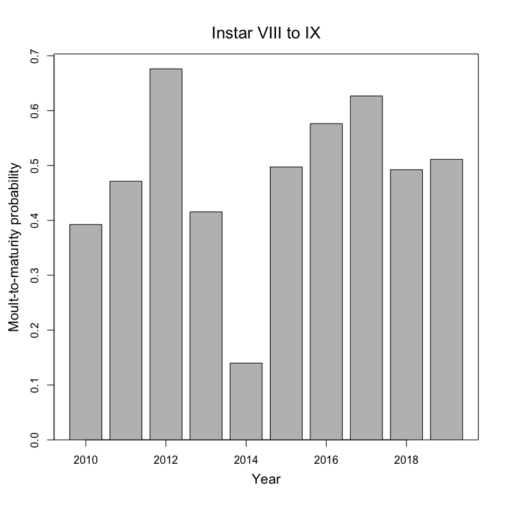

```{r setup, include=FALSE}
knitr::opts_chunk$set(echo = TRUE)
```
## Data 

Source data for the model came from the annual snow crab survey.

Length-frequencies standized by trawl swept area were calculated by survey year, sex and morphometric maturity.

For the purposes of evaluating and developping the snow crab model, the time series was limited to the period from  2006 to 2020, owing to the spatial homogeneity of the sampling design during this period. The survey was marginally expanded in 2011 and this will need to be considered when interpreting the model results.

The time series will be extended in future version of the model into past surveys where changing survey area and heterogenous spatial distributions may lead to some degree of scaling issues, which will hopefully be corrected by the model.

## Model

### Approach

The benthic stages of snow crab instars are traditionally numbered using roman numerals, with immature stages 
being instars I up to VII or VIII, characterized by high relative grow rates, followed by slower growing adolescence at instars VIII and IX for females and VIII to XII for males, and mature stages at instars IX and X for females and IX to XIII for males.

Instars I, II and III are too small to be caught by the survey. 
Instar IV crab are sometimes caught in small amounts.

Inferences on growth-at-moult can often be obtained from analysis of these modes and the approach has traditionally been to treat the data as arising from finite mixture model with probability density of the form:

$$
   \sum_{k=1}^{K} \pi_k \phi \left(x | \mu_k , \sigma_k^2  \right)
$$
where $k$ indexes the instars, $x$ represents crab size, $\pi_k$ are the proportions of each instar in the sample, $\mu_k$ are their mean sizes and $\sigma_k^2$ are their variances.

However, inference for larger instars is generally more uncertain owing to increasing variability in growth during adolescence, which resulting in size overlap between successive instars at these stages.

### Model Assumptions

- Skip-moulters moult to maturity the following year.
- Skip-moulters only exist from instar IX and onward.
- Matures exist only from instar IX onward.
- Females have negligible amounts of skip-moulting.

### Population dynamics equations

Stage-based processes affecting the population dynamics are the probability of moulting to maturity from one instar to the next, the probability of an instar skipping a moult (i.e. not growing and remaining mature) and annual mortality for immatures and matures.

The selectivity function is length-based, being a sigmoid-type function.

With $y$ indxing the survey year and $k$ indexing the instar, the population dynamics equations are as follows:

$$
\begin{aligned}
   n_{k,y}^{imm}  &= (1-p_{k-1,y-1}^{mat}) \times (1-p_{k-1}^{skip}) \times (1-M^{imm}) \times n_{k-1,y-1}^{imm} \\
   n_{k,y}^{skip} &= (1-p_{k-1,y-1}^{mat}) \times p_{k-1}^{skp} \times (1-M^{imm}) \times n_{k,y-1}^{imm} \\
   n_{k,y}^{rec}  &= (1-M^{mat}) \times \left[(1-p_{k-1}^{skp}) \times p_{k-1,y-1}^{mat} \times n_{k-1,y-1}^{imm} + n_{k-1,y-1}^{skip} \right] \\  
   n_{k,y}^{res}  &= (1-M^{mat}) \times \left[n_{k,y-1}^{rec} + n_{k,y-1}^{res} \right] \\ 
   n_{k,y}^{mat}  &= n_{k,y}^{rec} + n_{k,y}^{res}
\end{aligned}
$$
with the superscripts $imm$ representing regular immatures, $skip$ representing immatures which have skipped the previous moult, $rec$ representing new mature recruits, $res$ representing residuals matures and $mat$ representing all matures, i.e. the sum of recruits and residuals. 


|     Variable      | Description                                                         |
|:-----------------:|:--------------------------------------------------------------------|
| $n_{k,y}^{imm}$   | Population number of immature crab.
| $n_{k,y}^{skip}$  | Population number of immature crab which skipped the previous moult.
| $n_{k,y}^{rec}$   | Population number of new mature recruits.
| $n_{k,y}^{res}$   | Population number of old mature residuals (i.e. non-recruits).
| $n_{k,y}^{mat}$   | Population number of total mature crab.
| $M^{imm}$         | Annual proportion of immature crab which die off.
| $M^{mat}$         | Annual proportion of mature crab which die off.
| $p_{k,y}^{skip}$  | Annual proportion of immature crab which skip a moult. 
| $p_{k,y}^{mat}$   | Annual proportion of immature crab which moult to maturity. 

\newpage

## Figures

 

 

 


## To do: 
- Remove superfluous p_mat and p_skip row/column
- Add interaction error / mortality variability
- Add vessel effect
- Add mature growth modification   
- Display histograms with immatures y and mature y + 1 
- Add annual global scaling effect.
- Improve instar variance fit for matures.
- Improve growth mean fit for immature instars VIII and IX.
- Implement log_mu_year which better controls variability within instars
- Model seems to be growing adolescents too fast, but log_mu_year shrinks them back down ... an effort to....?
      
